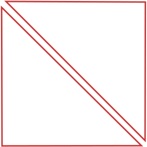
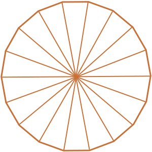
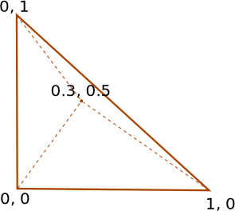

_Возможно, суровые бородатые дядьки, которые вовсю разрабатывают на OpenGL, закидают меня помидорами, но когда я узнал об этом, радовался как маленький ребёнок._

На протяжении последних двух месяцев я считал, что WebGL только и умеет, что рисовать треугольники.

_Да, треугольники, и больше ничего._

Например, чтобы нарисовать квадрат, ему нужно два треугольника:

А чтобы нарисовать круг, придётся немного попотеть! И всё равно, это будет не совсем круг:

_Сколько на картинке треугольников? 18!_

Но неожиданно оказывается, что есть более простой способ:

_Как вы думаете, сколько здесь используется треугольников?_

_Всего 1!_

### Всё просто

Мы знаем, что фрагментый шейдер вычисляется для каждого пикселя, а атрибуты, переданные в него через вершинный шейдер, линейно интерполируются между вершинами треугольника.

Значит, можно задать специальную систему координат, в которой укажем местоположение вершин треугольника и передадим их в шейдеры. Точно так же, как передаются uv-координаты при отрисовке текстуры.

Получается, что когда вызывается фрагментый шейдер, мы знаем положение пикселя в новой системе координат и можем на их основе вычислить цвет.

На примере выше мы говорим, что если пиксель находится в круге с центром (Cx, Cy) и радиусом R, т.е.

то закрашиваем его в синий цвет.

Вместо круга можно придумать что-нибудь более интересное:

<iframe src="./wheel.html" width="600" height="400"></iframe>

###Полезности

- [Cтраница](./circle.html) и [исходник](http://trufi.github.io/circle.html) первого примера с кругом
- [Cтраница](./wheel.html) и [исходник](http://trufi.github.io/wheel.html) второго примера с шестерёнкой
- [GPU Gems 3: Сhapter 25](http://http.developer.nvidia.com/GPUGems3/gpugems3_ch25.html) объясняется как рисовать тем же способом векторные изображения
